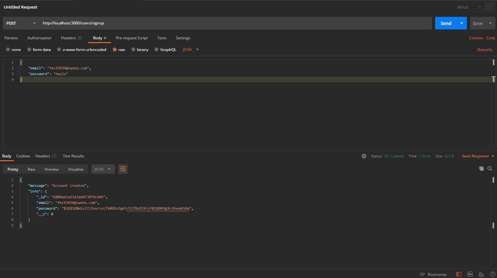
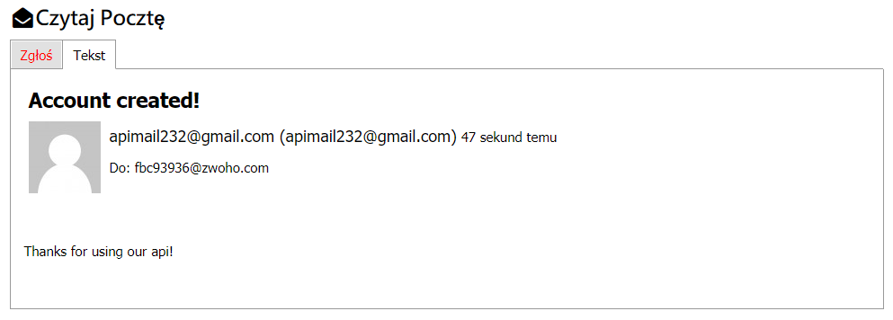
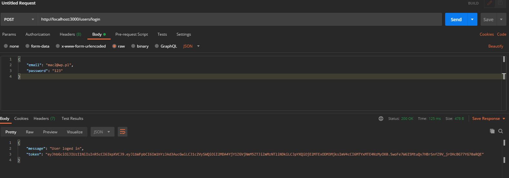
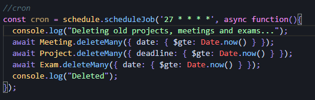
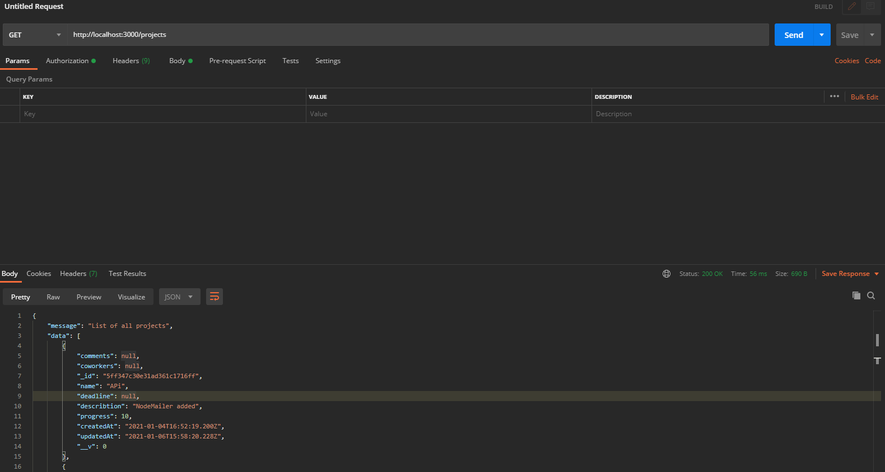
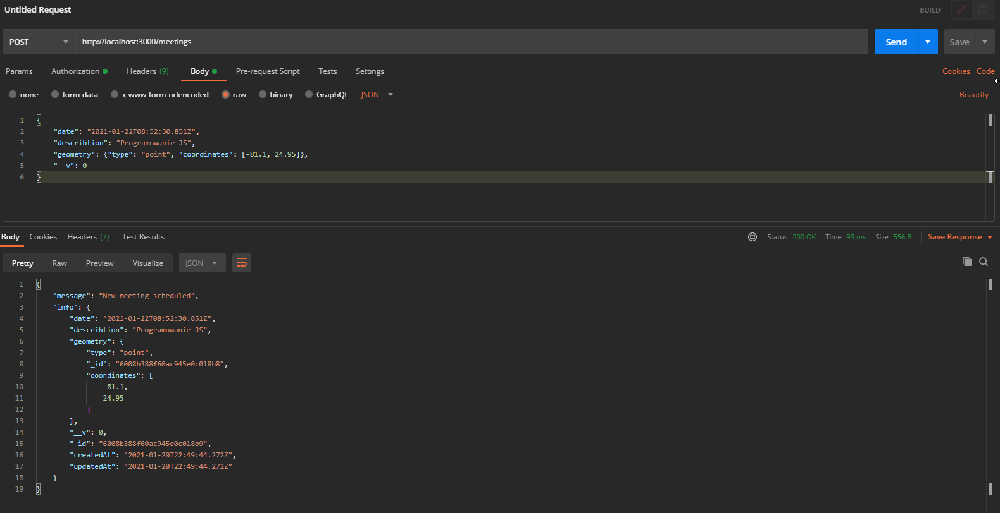
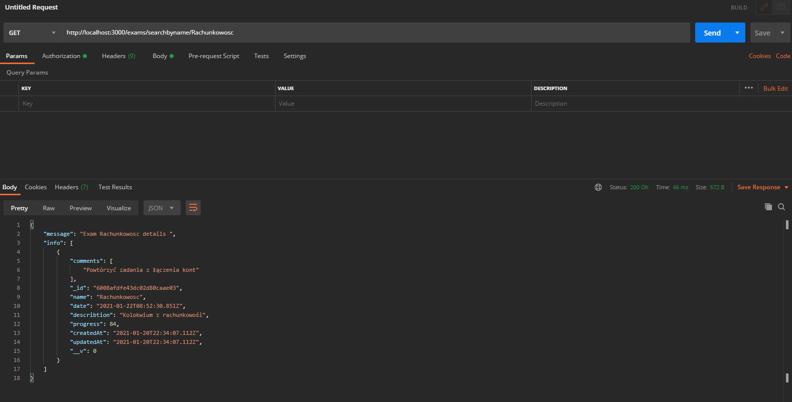
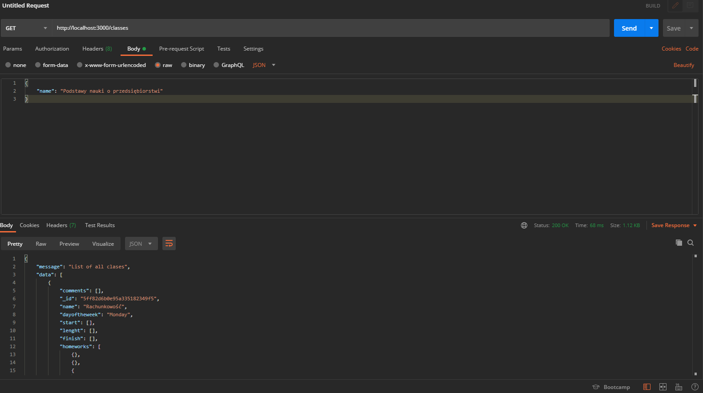
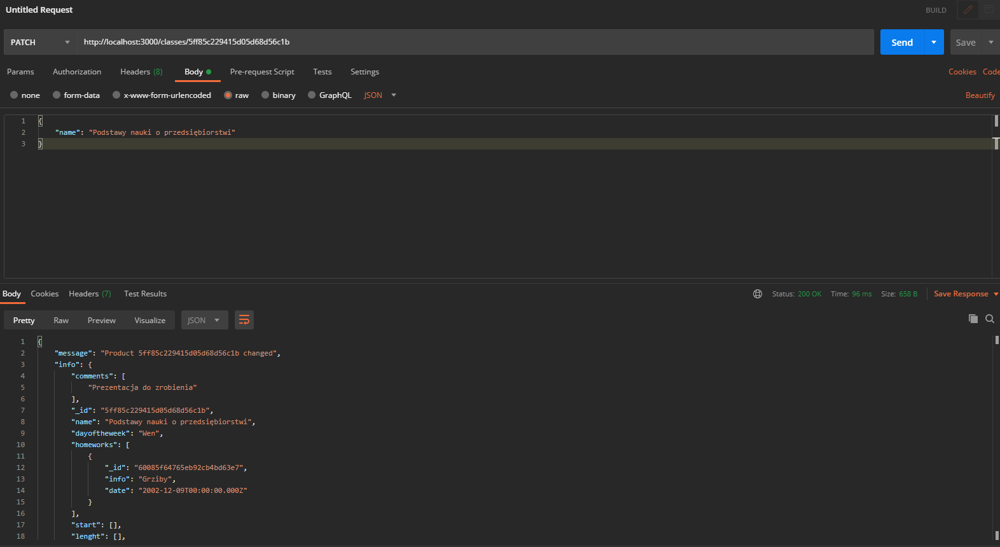

# Studies-Manager-API

Projekt na zaliczenie przedmiotu Programowanie aplikacji mobilnych

# Opis projektu

Proste REST API, które ułatwi zarządzanie projektami, spotkaniami, egzaminami oraz zapewni prosty i szybki dostęp do planu zajęć.

# Technologie oraz moduły, które wykorzystaliśmy w projekcie:
* NodeJS
* Express
* MongoDB
* Mongoose
* BodyParser
* JsonWebtoken
* Bcrypt
* Node-schedule
* Nodemailer

## Endpoints

```javascript

//Classes

router.get("/", checkAuth, ClassesController.timetable);

router.post("/", checkAuth, ClassesController.classNew);

router.get("/searchbyname/:name", checkAuth, ClassesController.classSearchByName);

router.get("/:name", checkAuth, ClassesController.classSearchById);

router.patch("/updatestatus/:id", checkAuth, ClassesController.classUpdateStatus);

router.delete("/:id", checkAuth, ClassesController.classDelete);

router.patch("/:id", checkAuth, ClassesController.classUpdate);

//Exams

router.get("/", checkAuth, ExamsController.examsAll);

router.post("/", checkAuth, ExamsController.examNew);

router.get("/searchbyname/:name", checkAuth, ExamsController.examSearchByName);

router.get("/:id", checkAuth, ExamsController.examSearchById);

router.patch("/updatestatus/:id", checkAuth, ExamsController.examUpdateStatus);

router.delete("/:id", checkAuth, ExamsController.examDelete);

router.patch("/:id", checkAuth, ExamsController.examUpdate);

//Projects

router.get("/", checkAuth, MeetingsController.meetings);

router.post("/", checkAuth, MeetingsController.meetingNew);

router.get("/:projectId", checkAuth, MeetingsController.meetingProjects);

router.get("/:id", checkAuth, MeetingsController.meetingSearchById);

router.delete("/:id", checkAuth, MeetingsController.meetingDelete);

router.patch("/:id", checkAuth, MeetingsController.meetingUpdate);

//Meetings

router.get("/", checkAuth, MeetingsController.meetings);

router.post("/", checkAuth, MeetingsController.meetingNew);

router.get("/:projectId", checkAuth, MeetingsController.meetingProjects);

router.get("/:id", checkAuth, MeetingsController.meetingSearchById);

router.delete("/:id", checkAuth, MeetingsController.meetingDelete);

router.patch("/:id", checkAuth, MeetingsController.meetingUpdate);

```

## Przykładowe zrzuty ekranu

# Rejestracja i Logowanie







# Cron

Usuwa projekty po terminie oraz zakończone egzaminy i spotkania



# Przykładowe Endpointy



```javascript
router.get("/", checkAuth, MeetingsController.meetings);
```



```javascript
router.post("/", checkAuth, MeetingsController.meetingNew);
```



```javascript
router.get("/searchbyname/:name", checkAuth, ExamsController.examSearchByName);
```



```javascript
router.get("/", checkAuth, ClassesController.timetable);
```



```javascript
router.patch("/:id", checkAuth, ClassesController.classUpdate);
```

## Twórcy
Maciej Winnik & Piotr Kiedrowski s22-32